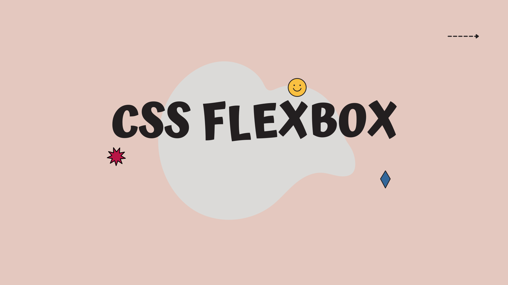
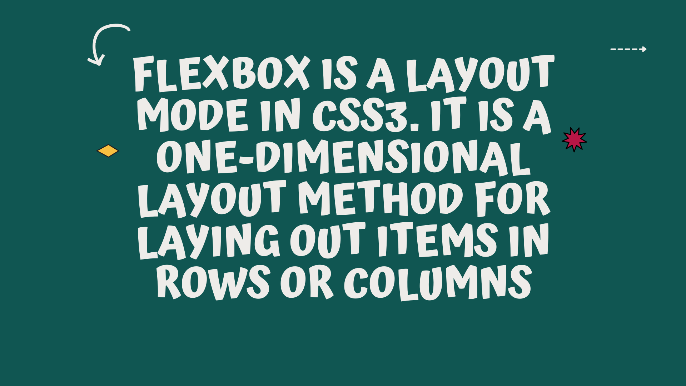
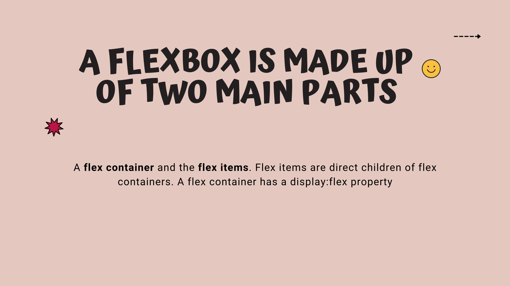
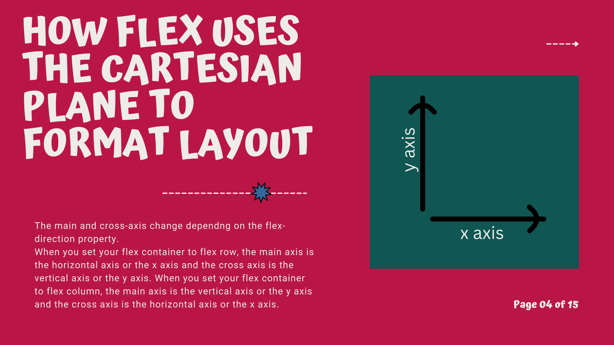
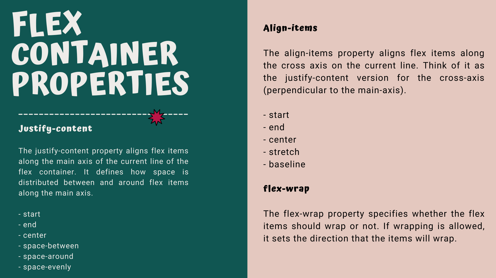
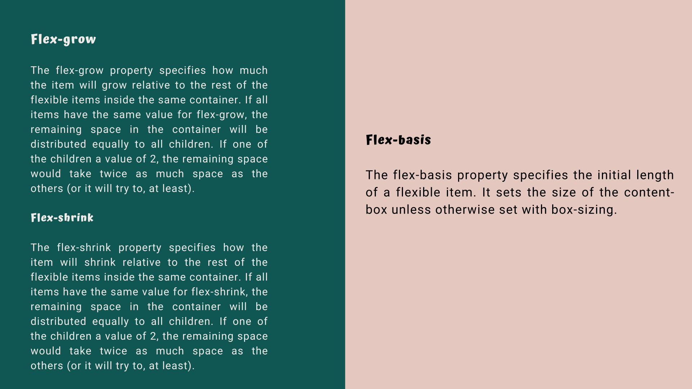

# CSS Flexbox
## What is Flexbox?
Flexbox is a layout mode in CSS3. It is a one-dimensional layout method for laying out items in rows or columns. It is a very powerful layout mode that can be used to create complex layouts with ease. It is also very easy to learn and use.
The flexbox model is a one dimensional layout that provides a method to offer space distribution and powerful alignment capabilities. 
Before flexbox, developers used floats and tables to align items. However, floats and tables are not well suited for layout. They are not responsive and they are not flexible. Flexbox is a much better solution for layout.



## Flex container and flex items
A flex container is the element that holds flex items. Flex items are direct children of flex containers. A container with display:flex.

```html
<html>
  <head>
    <style>
        .flex-container{
            display: flex;
        }
    </style>
  </head>
<body>

    <div class="flex-container">
      <div>Flex item one</div>
      <div>Flex item two</div>
      
    </div>
</body>
</html>
```




## Flex container properties

- flex-direction
- flex-wrap
- flex-flow
- justify-content
- align-items
- align-content

## Flex item properties
- order
- flex-grow
- flex-shrink
- flex-basis
- align-self




## Cartesian coordinate system
The Cartesian coordinate system is a two-dimensional coordinate system that specifies each point uniquely in a plane by a pair of numerical coordinates, which are the signed distances to the point from two fixed perpendicular directed lines, measured in the same unit of length.

## Flexbox terminology
- Main axis
- Main start
- Main end
- Main size
- Cross axis
- Cross start
- Cross end
- Cross size


The main and cross-axis change dependng on the flex-direction property.
When you set your flex container to flex row, the main axis is the horizontal axis or the x axis and the cross axis is the vertical axis or the y axis. When you set your flex container to flex column, the main axis is the vertical axis or the y axis and the cross axis is the horizontal axis or the x axis.

## N/B
A row is left to right and a column is top to bottom.



## Flex-container Properties
## Justify-content
The justify-content property aligns flex items along the main axis of the current line of the flex container. It defines how space is distributed between and around flex items along the main axis. 

- start
- end
- center
- space-between
- space-around
- space-evenly

## Align-items
The align-items property aligns flex items along the cross axis on the current line. Think of it as the justify-content version for the cross-axis (perpendicular to the main-axis).

- start
- end
- center
- stretch
- baseline

## flex-wrap
The flex-wrap property specifies whether the flex items should wrap or not. If wrapping is allowed, it sets the direction that the items will wrap.

## flex-grow
The flex-grow property specifies how much the item will grow relative to the rest of the flexible items inside the same container. If all items have the same value for flex-grow, the remaining space in the container will be distributed equally to all children. If one of the children a value of 2, the remaining space would take twice as much space as the others (or it will try to, at least).

## flex-shrink
The flex-shrink property specifies how the item will shrink relative to the rest of the flexible items inside the same container. If all items have the same value for flex-shrink, the remaining space in the container will be distributed equally to all children. If one of the children a value of 2, the remaining space would take twice as much space as the others (or it will try to, at least).

## flex-basis
The flex-basis property specifies the initial length of a flexible item. It sets the size of the content-box unless otherwise set with box-sizing.



## Resources

- [Flexbox Froggy](https://flexboxfroggy.com/)
- [Flexbox Defense](http://www.flexboxdefense.com/)
- [Flexbox Zombies](https://mastery.games/p/flexbox-zombies)
- [Flexbox Cheatsheet](https://yoksel.github.io/flex-cheatsheet/)
- [Flexbox in 5 minutes](https://medium.freecodecamp.org/an-animated-guide-to-flexbox-d280cf6afc35)
