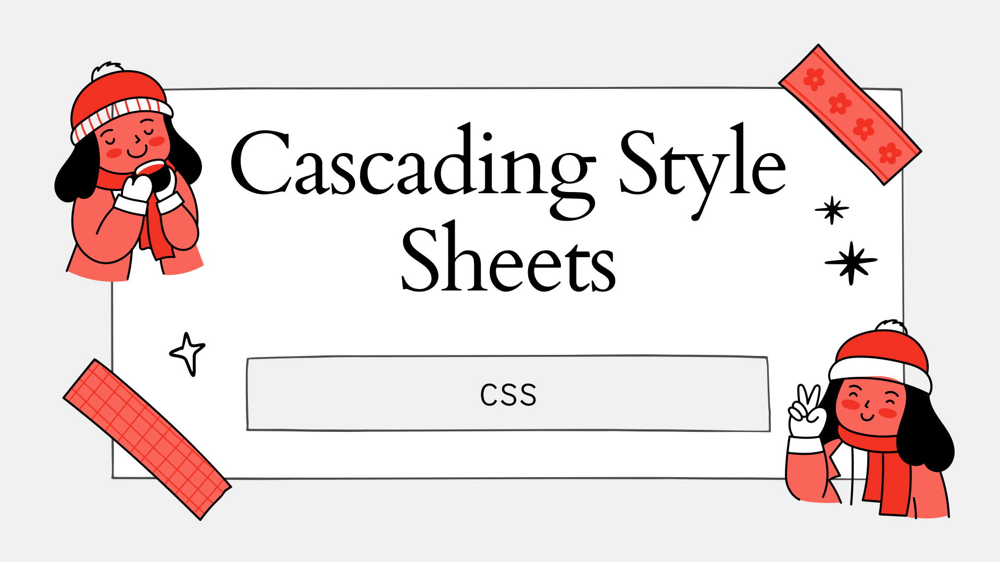
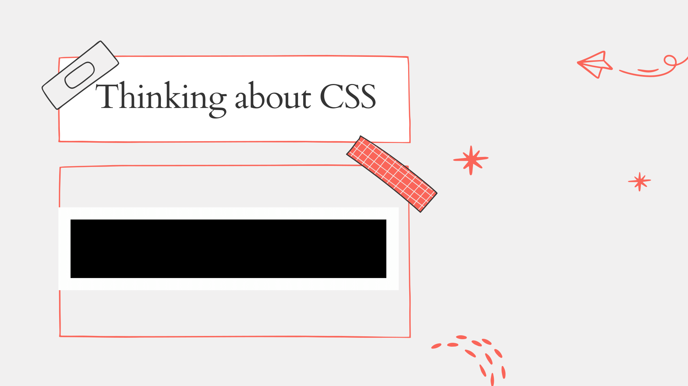
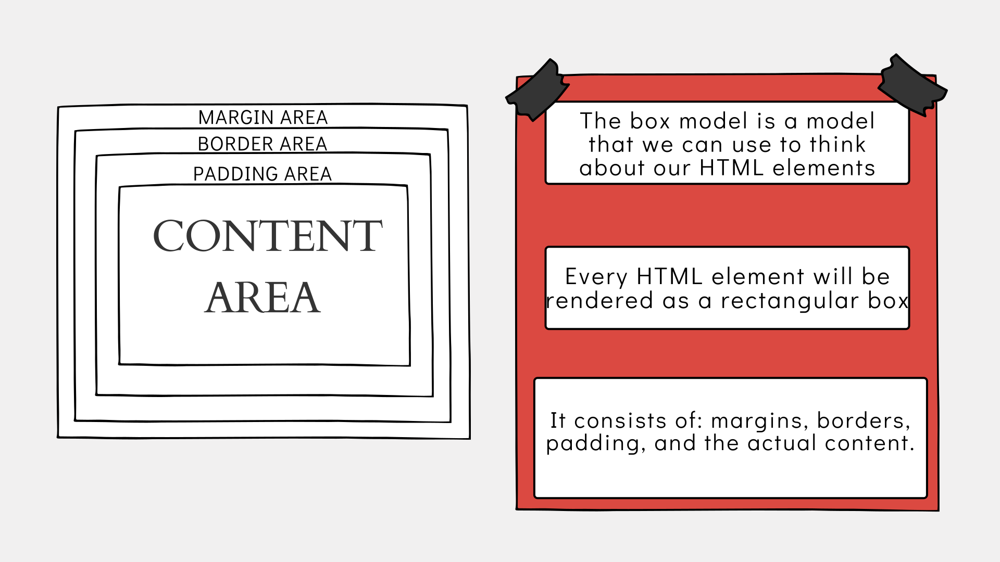
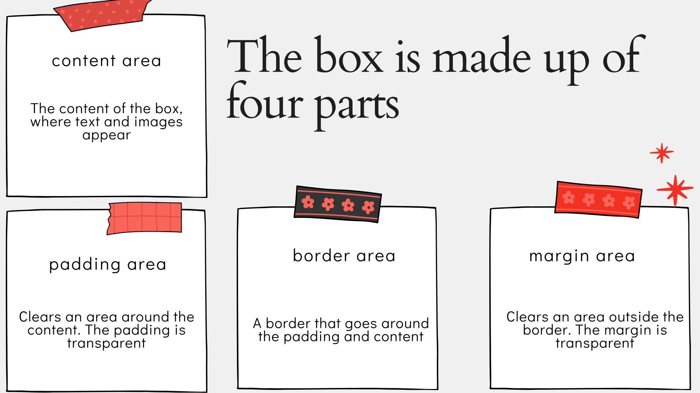
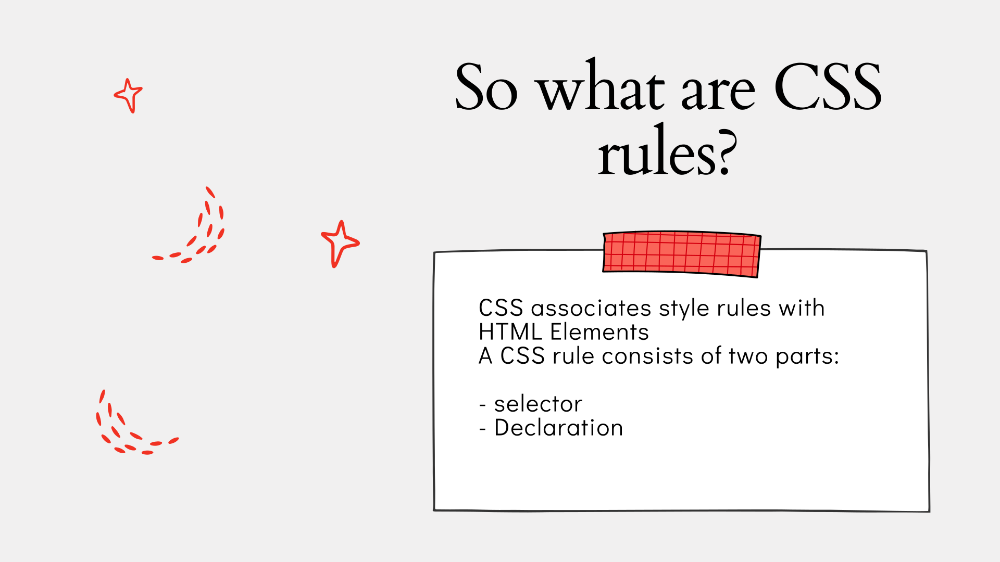
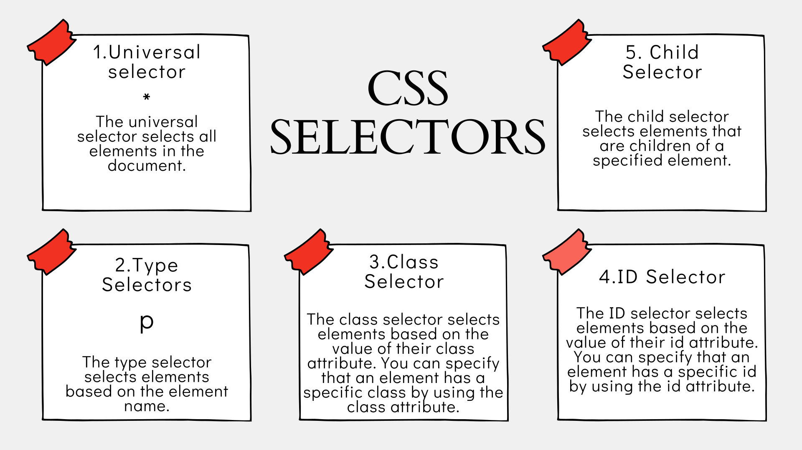
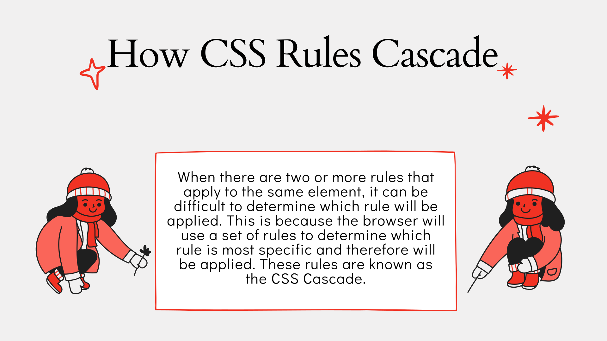

# Let's talk about CSS

## What is CSS?

Cascading Style Sheets (CSS) is a style sheet language used for describing the presentation of a document written in a markup language like HTML. CSS is a cornerstone technology of the World Wide Web, alongside HTML and JavaScript.

CSS allows you to create rules that specify how the content of an element should appear. For example, you can use CSS to specify that the background of the page is cream, the color of the text is dark blue, the size of the text is 12 points, and that all paragraphs should be centered.

## Talking about the Box Model

The CSS box model is essentially a box that wraps around every HTML element. It consists of: margins, borders, padding, and the actual content.

The box model is made up of four different parts: the content, padding, border, and margin. The content is the actual content of the box, such as text or an image. The padding is transparent and sits around the content. The border is transparent and sits around the padding. The margin is transparent and sits around the border.

## CSS Rules

CSS rules contain two parts: a selector and a declaration block. The selector points to the HTML element you want to style. The declaration block contains one or more declarations separated by semicolons. Each declaration includes a CSS property name and a value, separated by a colon.

## CSS Selectors

CSS selectors are used to "find" (or select) the HTML elements you want to style. There are many different types of CSS selectors that allow you to target rules to specific elements in an HTML document. Here are some of the most common CSS selectors:

- Universal selector ( * )

- Type selector ( h1, h2, h3 )

- Class selector ( .note )

- ID selector ( #introduction )

- Child selector ( li>a )

- Descendant selector ( p a )

- Adjacent sibling selector ( h1+p )

- General sibling selector ( h1~p )

## CSS Properties

CSS properties are used to specify the look of HTML elements. For example, to change the color of the text inside an element, you can use the color property. There are hundreds of different CSS properties that allow you to control the color, font, size, spacing, and many other aspects of HTML elements. Here are some of the most common CSS properties:

- color

- font-family

- font-size

- font-weight

- text-align

- line-height

- letter-spacing

- word-spacing

- text-transform

- text-decoration

- text-indent

## Cascading

Cascading refers to the way in which rules are applied when more than one rule could apply to a certain element. This is determined by specificity and inheritance. Specificity refers to which selector is the most specific and therefore wins out over more general selectors. Inheritance refers to which properties are inherited by child elements from their parent elements. In general, more specific selectors will take precedence over more general ones. If two selectors are equally specific, the latter of the two will take precedence. Inheritance works the opposite way: more general selectors will take precedence over more specific ones. If two selectors are equally general, the former of the two will take precedence. The CSS cascade is based on the following principles, which are applied to all CSS documents, regardless of external stylesheets, embedded stylesheets, or inline styles:

- More specific selectors will override more general ones.

- More recently defined rules will override more previously defined ones.

- If two selectors are equally specific, the latter of the two will take precedence.

- If two selectors are equally general, the former of the two will take precedence.

- If two rules are equally specific and equally general, the latter of the two will take precedence.

## Responsive Web Design

Responsive web design is an approach to web design that makes web pages render well on a variety of devices and window or screen sizes. Recent work also considers the viewer proximity as part of the viewing context as an extension for RWD. Content, design and performance are necessary across all devices to ensure usability and satisfaction.

## Media Queries

Media queries allow you to specify different styles for individual browser and device circumstances, the width of the viewport or device orientation for example. You can include a media query within your CSS rules by using the @media rule. You can include as many selectors and styles inside the @media block as you want.

## Mobile First

Mobile first is a web design approach that prioritizes mobile users over desktop users. It is a strategy that involves designing for mobile devices first and then scaling up components as necessary using CSS media queries. Mobile first is a strategy that involves designing for mobile devices first and then scaling up components as necessary using CSS media queries.

