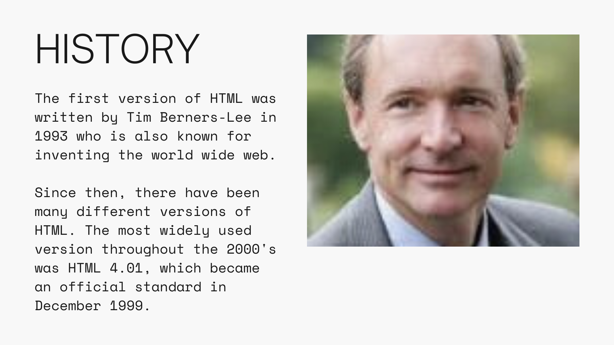
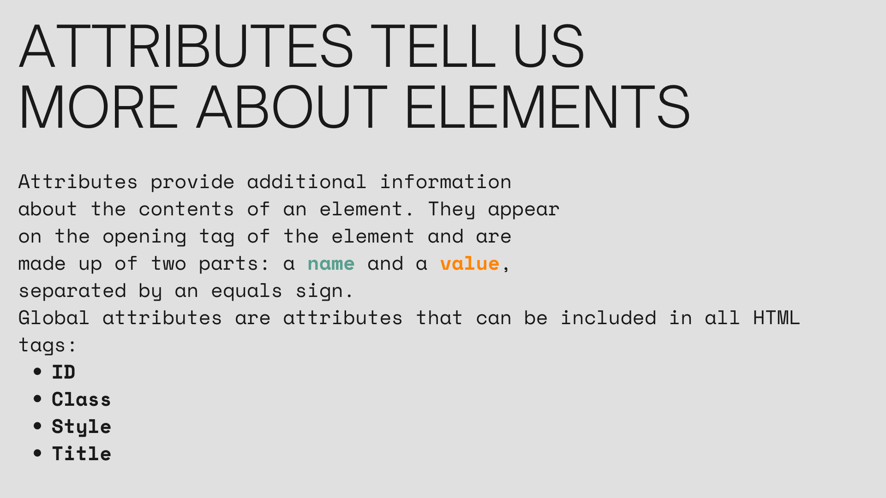

# Let's talk about HTML


# What is HTML?

HTML is the standard markup language for creating web pages and web applications. With Cascading Style Sheets (CSS) and JavaScript, it forms a triad of cornerstone technologies for the World Wide Web. Web browsers receive HTML documents from a web server or from local storage and render the documents into multimedia web pages. HTML describes the structure of a web page semantically and originally included cues for the appearance of the document.


# The History of HTML

HTML was created by Tim Berners-Lee in late 1991 but "HTML 2.0" was the first standard HTML specification, published in 1995. The World Wide Web Consortium (W3C), originally the Web Standards Project, was created in October 1994 to lead the World Wide Web to its full potential by developing protocols and guidelines that ensure the long-term growth of the Web.


# How HTML Works

HTML is a markup language that uses a special syntax or notation to annotate text files to achieve font, color, graphic, and hyperlink effects on World Wide Web pages. HTML documents might be rendered to a screen, or through a speech synthesizer, or on a braille display. HTML elements are the building blocks of HTML pages. With HTML constructs, images and other objects, such as interactive forms, may be embedded into the rendered page. It provides a means to create structured documents by denoting structural semantics for text such as headings, paragraphs, lists, links, quotes and other items. HTML elements are delineated by tags, written using angle brackets. Tags such as `` and `<input />` directly introduce content into the page. Other tags such as `<p>` surround and provide information about document text and may include other tags as sub-elements. Browsers do not display the HTML tags, but use them to interpret the content of the page.


Tags act like containers. They tell you something about the information that lies between their opening and closing tags.

## Defining HTML Elements

HTML elements are defined by a start tag, some content, and an end tag:

```html

<p>Content goes here...</p>

```
In the example above, we are defining a paragraph element. The start tag is `<p>` and the end tag is `</p>`. The content is `Content goes here...`. The content is what is between the start and end tags.


## HTML Attributes

HTML attributes provide additional information about HTML elements. Attributes are always specified in the start tag. Attributes usually come in name/value pairs like: name="value".

```html


```
In the example above, we are defining an image element. The start tag is ``. The `src` attribute specifies the path to the image to be displayed. The `alt` attribute specifies an alternate text for the image, if the image for some reason cannot be displayed.



## HTML Comments

HTML comments are not displayed in the browser, but can be read by the source code. Comments are used to explain code, and to prevent execution when testing alternative code.

```html

<!-- This is a comment -->

```

## HTML Document Structure

The HTML document is the main container for all other HTML elements. The HTML document is defined by the `<html>` tag:

```html

<html>
  <head>
    <title>Page Title</title>
  </head>
  <body>
    <h1>My First Heading</h1>
    <p>My first paragraph.</p>
  </body>

</html>

```

The `<html>` element is the root element of an HTML page. The `<html>` element contains the `<head>` and `<body>` elements.

The `<head>` element contains meta information about the HTML page.

The `<title>` element specifies a title for the HTML page (which is shown in the browser's title bar or in the page's tab).

The `<body>` element contains the visible page content.

The `<h1>` element defines a large heading.

The `<p>` element defines a paragraph.


## Resources

- [W3Schools](https://www.w3schools.com/html/)
- [MDN](https://developer.mozilla.org/en-US/docs/Web/HTML)
- [HTML Dog](https://htmldog.com/guides/html/beginner/)
- [HTML Cheat Sheet](https://websitesetup.org/html5-cheat-sheet/)
- [HTML Reference](https://htmlreference.io/)
- [HTML Validator](https://validator.w3.org/)
- [HTML Color Picker](https://www.w3schools.com/colors/colors_picker.asp)
- [HTML Color Codes](https://htmlcolorcodes.com/)
