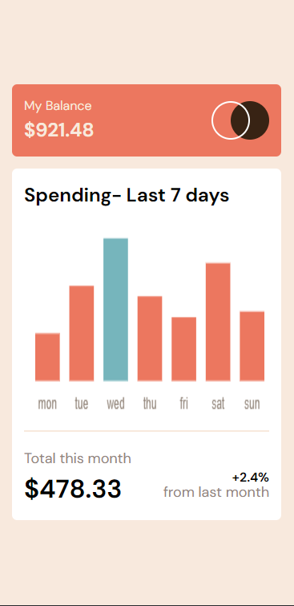
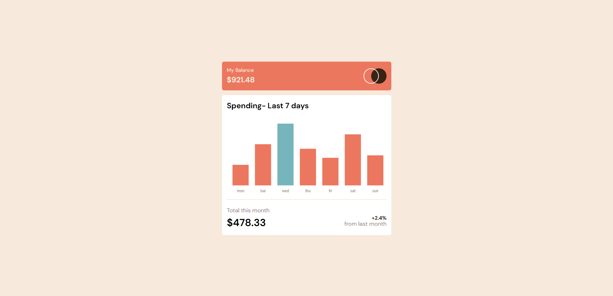

# Frontend Mentor - Expenses chart component solution

This is a solution to the [Expenses chart component challenge on Frontend Mentor](https://www.frontendmentor.io/challenges/expenses-chart-component-e7yJBUdjwt). Frontend Mentor challenges help you improve your coding skills by building realistic projects. 

## Table of contents

- [Overview](#overview)
  - [The challenge](#the-challenge)
  - [Screenshot](#screenshot)
  - [Links](#links)
- [My process](#my-process)
  - [Built with](#built-with)
  - [Continued development](#continued-development)
  - [Useful resources](#useful-resources)
- [Author](#author)

## Overview

### The challenge

Users should be able to:

- View the bar chart and hover over the individual bars to see the correct amounts for each day
- See the current day’s bar highlighted in a different colour to the other bars
- View the optimal layout for the content depending on their device’s screen size
- See hover states for all interactive elements on the page
- **Bonus**: Use the JSON data file provided to dynamically size the bars on the chart

### Screenshot

Mobile Screenshot

Desktop Screenshot

### Links

- Solution URL: [Github Link](https://github.com/IanMcbull/frontend-mentor-expense-chart)
- Live Site URL: [Live Link](https://expense-chart-component-fem.netlify.app/)

## My process

### Built with

- Semantic HTML5 markup
- CSS custom properties
- Flexbox
- CSS Grid
- Mobile-first workflow

### Continued development

I feel like i can work on making my css less verbose and adopt more CSS3 syntax.

### Useful resources

- [ChartJS Tutorial Youtube Channel](https://www.youtube.com/@ChartJS-tutorials) - The ChartJS tutorial youtube channel was very useful when it came to styling the chart.
- [ChartJS Documentation](https://www.chartjs.org/docs/latest/) - The ChartJS documentation also came in handy.

## Author

- Website - [Ian Mugenya](https://ianmugenya.netlify.app/)
- Frontend Mentor - [@IanMcbull](https://www.frontendmentor.io/profile/IanMcbull)
- Twitter - [@Mcbooll](https://twitter.com/McBooll)

## Acknowledgments

This is where you can give a hat tip to anyone who helped you out on this project. Perhaps you worked in a team or got some inspiration from someone else's solution. This is the perfect place to give them some credit.

