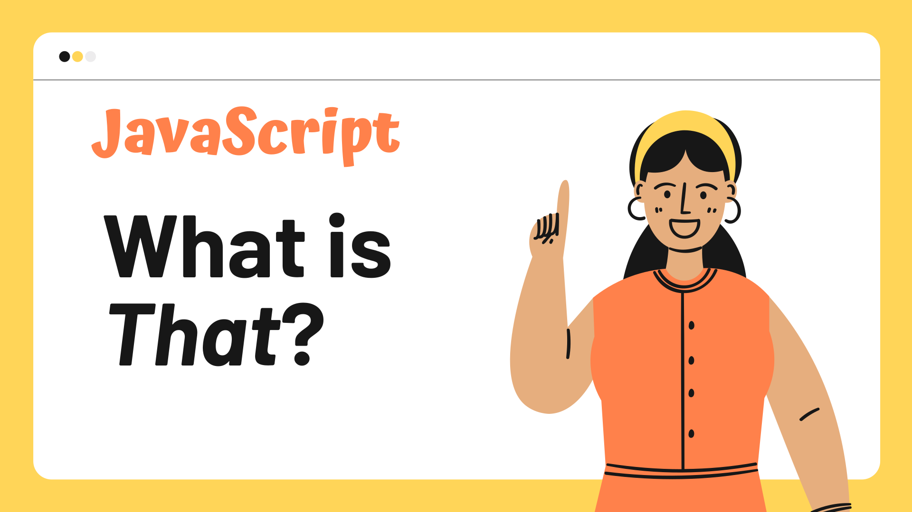
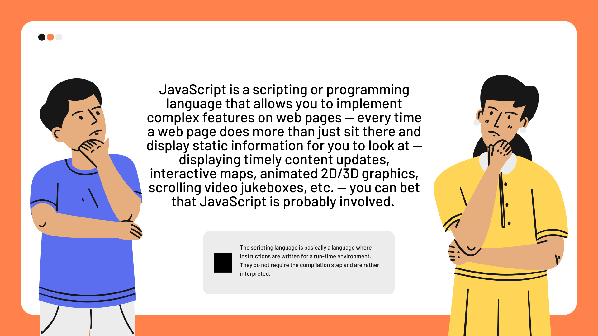
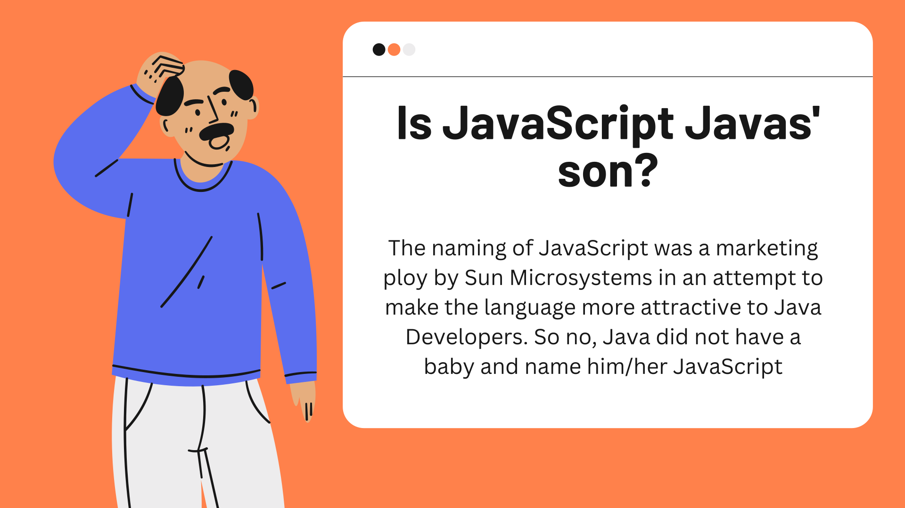
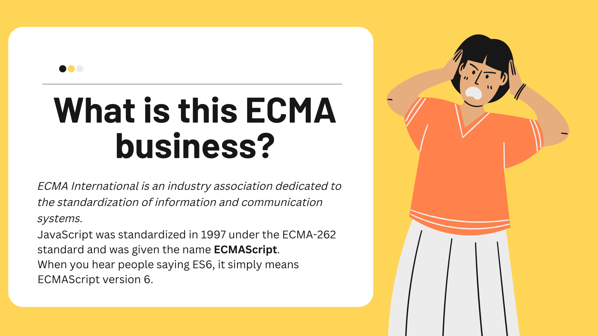
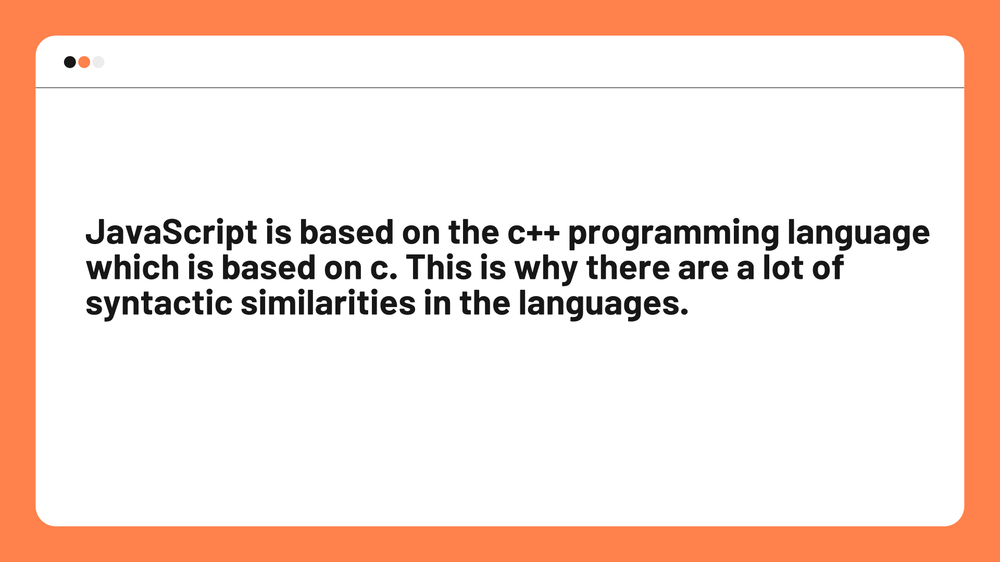
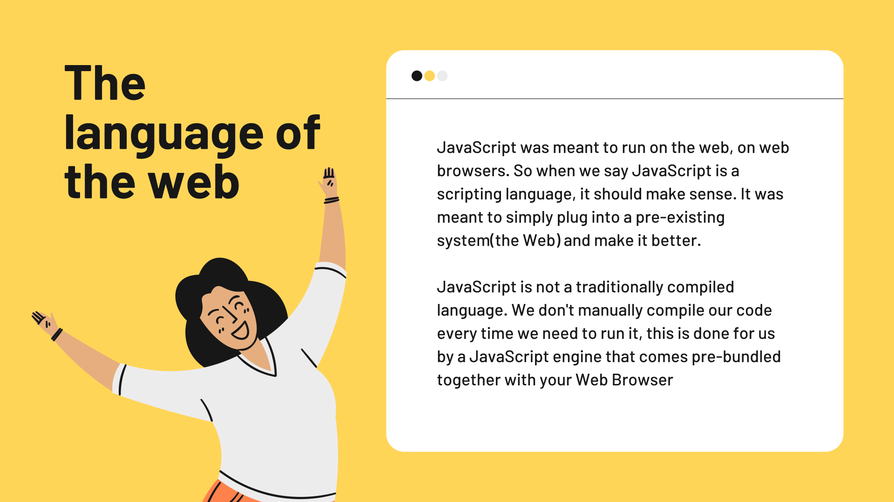
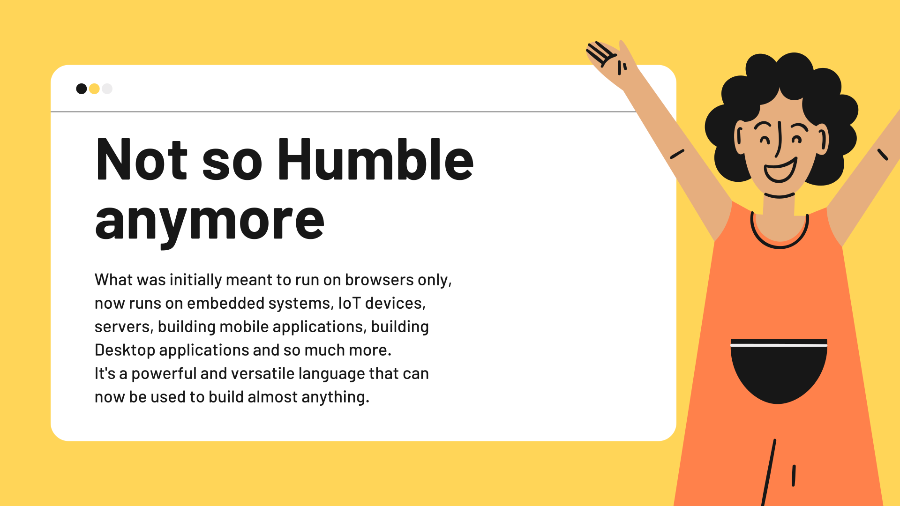

# Let's talk about JavaScript


## What is JavaScript?

JavaScript is a lightweight, interpreted, or just-in-time compiled programming language with first-class functions. While it is most well-known as the scripting language for Web pages, many non-browser environments also use it, such as Node.js, Apache CouchDB and Adobe Acrobat. JavaScript is a prototype-based, multi-paradigm, single-threaded, dynamic language, supporting object-oriented, imperative, and declarative (e.g. functional programming) styles.



## Is JavaScript Java?




No. JavaScript is not Java. JavaScript was originally named LiveScript, but Netscape changed its name to JavaScript, possibly because of the excitement over Java. But JavaScript is not related to Java. JavaScript is a scripting language that is used to make web pages interactive. Java is a programming language that is used to make applications.


## What is ECMAScript?



ECMAScript is the standard that JavaScript is based on. It was created to standardize JavaScript, so different browsers all support the same JavaScript. ECMAScript is also used to create other languages that are very similar to JavaScript, such as JScript and ActionScript.

## JavaScript Engines



JavaScript engines are computer programs that execute JavaScript code. Most web browsers have an embedded JavaScript engine to execute JavaScript code. The most popular JavaScript engine is called V8. It is open source, and was created by the company that makes the Chrome web browser. V8 is written in C++. It is used in Chrome, Node.js, and in many other products.





## JavaScript Data Types

JavaScript variables can hold many data types: numbers, strings, objects and more:

- Number
- String
- Boolean
- Object
- Array
- Function
- Undefined

## JavaScript Operators

JavaScript has the following types of operators. This section describes the operators and contains information about operator precedence.

- Assignment operators `=`
- Comparison operators `> < >= <= == === != !==` 
- Arithmetic operators `+ - * / % ++ --`
- Bitwise operators `& | ^ ~ << >> >>>`
- Logical operators `&& || !`
- String operators `+`
- Conditional (ternary) operator `? :`
- Comma operator `,`
- Unary operators `delete typeof void`
- Relational operators `in instanceof`

## JavaScript Functions

A JavaScript function is a block of code designed to perform a particular task.

A JavaScript function is executed when "something" invokes it (calls it).

```js

function myFunction(p1, p2) {
  return p1 * p2;   // The function returns the product of p1 and p2
}

```


## JavaScript Objects

In JavaScript, almost "everything" is an object.
An object can be defined as a collection of related data and/or functionality (which usually consists of several variables and functions — which are called properties and methods when they are inside objects).

```js

var person = {
  firstName: "John",
  lastName : "Doe",
  id     : 5566,
  fullName : function() {
    return this.firstName + " " + this.lastName;
  }
};

```

Booleans can be objects (if defined with the new keyword)

```js

let x = new Boolean(false);

```

Numbers can be objects (if defined with the new keyword)

```js

let x = new Number(123);

```

## JavaScript Hoisting

Hoisting is JavaScript's default behavior of moving all declarations to the top of the current scope (to the top of the current script or the current function).


## JavaScript Strict Mode

Strict mode is a new feature in JavaScript used to indicate that the code should be executed in "strict mode".

With strict mode, you can not, for example, use undeclared variables.

## JavaScript Scope

In JavaScript, scope defines the accessibility (visibility) of variables.

JavaScript has only two scopes: **Global scope** and **Local scope**.

```js

let x = 10;    // Global scope

function myFunction() {
  let y = 20;  // Local scope
}

```

## JavaScript Events

An HTML event can be something the browser does, or something a user does.

```js

<button onclick="document.getElementById('demo').innerHTML = Date()">The time is?</button>

```

Here are some examples of HTML events:

- An HTML web page has finished loading
- An HTML input field was changed
- An HTML button was clicked
- Often, when events happen, you may want to do something.

## JavaScript Strings

A JavaScript string is zero or more characters written inside quotes.

```js

let carName1 = "Volvo XC60";   // Using double quotes
```
## JavaScript Numbers

In JavaScript, numbers can be written with, or without decimals.

```js

let x1 = 34.00;   // Written with decimals

```
## JavaScript Arrays

JavaScript arrays are used to store multiple values in a single variable.

```js

let cars = ["Saab", "Volvo", "BMW"];

```

## JavaScript Booleans

Booleans can only have two values: true or false.

```js

let x = 5;

```
## JavaScript Dates

JavaScript Date objects represent a single moment in time in a platform-independent format.

```js

let d = new Date();

```

## JavaScript Math

JavaScript has a Math object that has properties and methods for mathematical constants and functions.

```js

let x = Math.PI;

```

## JavaScript Regular Expressions

A regular expression is an object that describes a pattern of characters.

```js

let patt = /w3schools/i;

```

## JavaScript Errors

If JavaScript encounters an error, it will normally stop and generate an error message.

## JavaScript Statements

JavaScript statements are composed of:

- Values, Operators, Expressions, Keywords, and Semicolons

## JavaScript Comments

JavaScript comments can be used to explain JavaScript code, and to make it more readable.

## JavaScript Variables

In programming, variables are used to store data values.

```js

let carName;

```


## JavaScript Keywords

JavaScript has 50 reserved words, which cannot be used as variable names.

```js

break
case
catch
class
const
continue
debugger
default
delete
do
else
export
extends
finally
for
function
if
import
in
instanceof
new
return
super
switch
this
throw
try
typeof
var
void
while
with
yield

```


## JavaScript Identifiers

In JavaScript, identifiers are used to name variables (and keywords, functions, labels).



