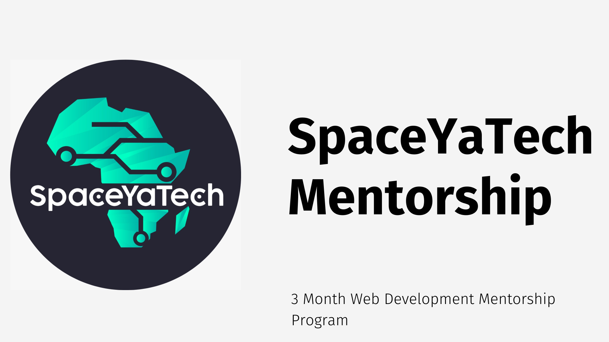

# SpaceYaTech Mentorship Program

The SpaceYaTech Mentorship Program is our flagship mentorship program. The program is designed to be flexible and is tailored to meet the needs of developers looking to learn JavaScript, CSS and HTML. 

We employ a practical approach to our teaching process; we help mentees by building mini projects that allow them to put into practice what they learn, as we teach therotetical concepts of web development. This way, mentees get a good grasp of what they learn and can quickly apply them in their day-to-day web development tasks and achieve their career goals.

We have a team of mentors who are experts in their fields and are willing to share their knowledge and experience with mentees.

## Table of contents

- [Why a mentorship program](#why-a-mentorship-program)
- [The Process](#the-process)
- [Who were we targeting](#who-were-we-targeting)
- [Selecting the mentors](#how-did-we-select-the-mentors)
- [Selecting the mentees](#how-did-we-select-the-mentees)
- [The Curriculum](#the-curriculum)

## Why a Mentorship Program?
[SpaceYaTech](https://www.spaceyatech.com/) is now one of the fastest growing tech communities in Kenya. This is down to the twitter spaces that we hold every Thursdays from 8PM EAT. 

The spaces revolve around a multitude of tech topics, from landing your first job in tech, to the current state of tech to the latest tech trends. 
We invite industry experts to share their knowledge and experience with the community.

As a result of this, we have had a lot of requests from people who want to join the tech industry but don't know where to start. We have also had requests from people who want to learn a new skill or improve on their current skillset. 

This is the why behind the mentorship program. A way to give back to the community and help people achieve their goals.

## The Process

- [x] Create a curriculum for the program
- [x] Onboard the mentors.
- [x] Onboard the mentees.
- [x] Mentees are matched with mentors.
- [x] The mentors and the mentees are divided into groups.

## Who were we targeting?
For the first cohort of the program, we targeted complete beginners who want to learn the fundamentals of web development. We decided to focus on web development because it is the most popular skillset in the tech industry and one of the most in-demand skills. Web development is a denominating factor in most tech jobs.

## How did we select the mentees?
We selected the mentees based on the following criteria:

- [x] They are passionate about tech.
- [x] They are willing to learn.
- [x] They are willing to put in the work.

For this cohort, we onboarded 30 mentees. We will be increasing the number of mentees in the next cohort.

## How did we select the mentors?
We selected the mentors based on the following criteria:

- [x] They are passionate about tech.
- [x] They are willing to share their knowledge and experience with the mentees.
- [x] They are willing to put in the work.

For this cohort, we onboarded 6 mentors. We will be increasing the number of mentors in the next cohort.

## The Curriculum

The [Curriculum](https://www.canva.com/design/DAFNTnoaMm4/0hB5vFYa7vdY_hfA-hRM9Q/view?utm_content=DAFNTnoaMm4&utm_campaign=designshare&utm_medium=link&utm_source=publishsharelink) focuses on the basics of web development. The curriculum is divided into 3 phases:

- [x] Phase 1: HTML & CSS
- [ ]  Phase 2: JavaScript
- [ ]  Phase 3: Build projects

## Phase 1: HTML & CSS
The first phase focuses on the basics of HTML & CSS. The mentees are introduced to the basics of HTML & CSS and are given a project to build. The project is the [QR Code Component](https://www.frontendmentor.io/challenges/qr-code-component-iux_sIO_H) challenge from [FrontEnd Mentor](https://www.frontendmentor.io/home).

## Phase 2: JavaScript
The second phase focuses on the basics of JavaScript. The mentees are introduced to the basics of JavaScript and are given a project to build. The project is a simple [Expense Chart Component](https://www.frontendmentor.io/challenges/expenses-chart-component-e7yJBUdjwt) challenge from [FrontEnd Mentor](https://www.frontendmentor.io/home). 

## Phase 3: Build Projects
The third phase focuses on building projects. The mentees will be expected to build 3 projects in 3 weeks.

## Week 1
The mentees will be expected to build the [Sunnyside Agency Landing Page]([https://www.frontendmentor.io/challenges/sunnyside-agency-landing-page-7yVs3B6ef](https://res.cloudinary.com/dz209s6jk/image/upload/f_auto,q_auto:good,w_900/Challenges/wqzotbyfysz9pbfk9jus.jpg)) challenge from [FrontEnd Mentor](https://www.frontendmentor.io/home).

## Week 2
The mentees will be expected to build the [Advice Generator App](https://www.frontendmentor.io/challenges/advice-generator-app-QdUG-13db) challenge from [FrontEnd Mentor](https://www.frontendmentor.io/home).

## Week 3
The mentees will be expected to build the [Space tourism multipage website](https://www.frontendmentor.io/challenges/space-tourism-multipage-website-gRWj1URZ3) challenge from [FrontEnd Mentor](https://www.frontendmentor.io/home).

